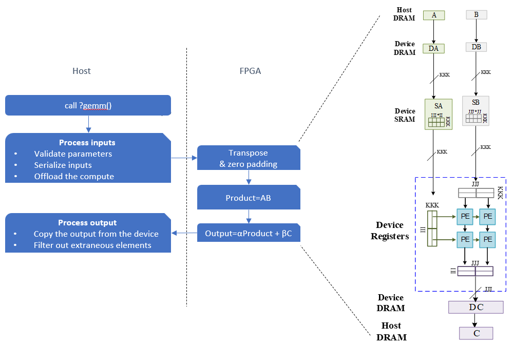

# `GEMM` Sample

This reference design shows how to implement oneMKL-compatible GEMM (*General Matrix Multiply*) using the [T2SP](https://github.com/IntelLabs/t2sp) DSL and compile the DSL to oneAPI code:

* `gemm.cpp` - The implementation of GEMM using T2SP DSL.

* `test.cpp` - Some correctness tests from [oneMKL's test suite](https://github.com/oneapi-src/oneMKL/blob/develop/tests/unit_tests/blas/level3/gemm.cpp), using oneMKL's GEMM as a reference.

* `hardware_demo.cpp` - A demo showing how to compile GEMM to FPGA hardware.

| Area                | Description                                                  |
| ------------------- | ------------------------------------------------------------ |
| What you will learn | How to implement high performance GEMM on an FPGA using T2SP |
| Time to complete    | ~1 hr (excluding compile time)                               |
| Category            | Reference Designs and End to End                             |
	
## Purpose

This FPGA reference design demonstrates GEMM, as defined in [oneMKL](https://www.intel.com/content/www/us/en/docs/onemkl/developer-reference-fortran/2023-1/gemm-001.html):

```
C := alpha*op(A)*op(B) + beta*C
```
where `op(X)` is one of `op(X) = X`, or `op(X) = X<sup>T</sup>`, or `op(X) = X<sup>H</sup>`, `alpha` and `beta` are scalars, and `A`, `B` and `C` are matrices.

The algorithm employed by the reference design is a 2-dimensional systolic array  with a sophisticated I/O network.


## Prerequisites

This sample is part of the FPGA code samples.
It is categorized as a Tier 4 sample that demonstrates a reference design.


| Optimized for        | Description
|:---                  |:---
| OS                   | Ubuntu* 18.04/20.04 (Other Linux distributions might also work, although not tested)
| Hardware             | Intel® Programmable Acceleration Card with Intel® Arria® 10 GX FPGA (Intel® PAC with Intel® Arria® 10 GX FPGA) <br> Intel® FPGA Programmable Acceleration Card (PAC) D5005 (with Intel Stratix® 10 SX)
| Software             | Intel® oneAPI DPC++/C++ Compiler, T2SP compiler

### Performance

TODO

## Key Implementation Details



## Build the `GEMM` Design

### On Linux*

1. Configure the build system for **Intel® PAC with Intel Arria® 10 GX FPGA**, which is the default.
   
   ```shell
   mkdir -p build
   cd build
   cmake ..
   ```
   
   For **Intel Stratix® 10 SX**, enter the following:
   
   ```shell
   mkdir -p build
   cd build
   cmake .. -DFPGA_DEVICE=intel_s10sx_pac:pac_s10
   ```

2. Compile the design.
   
   ```shell
   # Generate test, compile for emulation (fast compile time, targets emulated FPGA device).
   make test
   # Generate the HTML performance report.
   make report
   # Generate fpga demo, compile for FPGA hardware (longer compile time, targets FPGA device).
   make fpga
   ```

## Run the `GEMM` Design

### On Linux

#### Run on FPGA Emulator

```shell
./test_0 && ./test_1 && ./test_2 && ./test_3 && ./test_4
```

#### Run on FPGA

```shell
./fpga
```