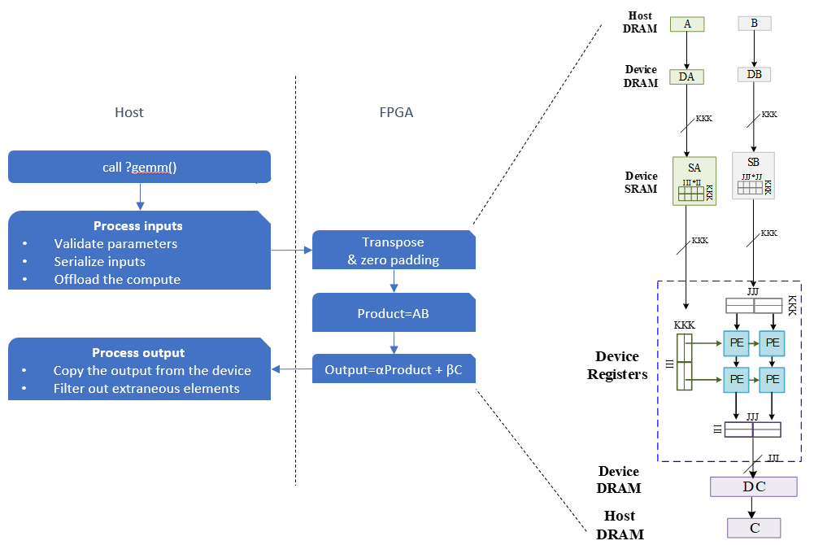

# Matrix Multiplication

This reference design shows how to implement a matrix multiplication circuit that can be dynamically reconfigured to implement the following BLAS kernels:

* `GEMM` - Computes a matrix-matrix product with general matrices.
* `SYMM` - Computes a matrix-matrix product where one input matrix is symmetric and one matrix is general.
* `HEMM` - Computes a matrix-matrix product where one input matrix is Hermitian and one matrix is general.
* `SYRK` - Performs a symmetric rank-k update.
* `HERK` - Performs a Hermitian rank-k update.

The design is compatible with [oneMKL](https://www.intel.com/content/www/us/en/docs/onemkl/developer-reference-dpcpp/2023-0/blas-level-3-routines.html) and written in the [T2SP](https://github.com/IntelLabs/t2sp) DSL, which generates oneAPI code.

| Area                | Description                                                  |
| ------------------- | ------------------------------------------------------------ |
| What you will learn | How to implement high performance matrix multiplication on an FPGA |
| Time to complete    | ~1 hr (excluding compile time)                               |
| Category            | Reference Designs and End to End                             |

## Purpose

This design demonstrates the following matrix-matrix product:

```
C := alpha*op(A)*op(B) + beta*C
```
where `op(X)` is one of `op(X) = X`, or `op(X) = X<sup>T</sup>`, or `op(X) = X<sup>H</sup>`, `alpha` and `beta` are scalars, and `A`, `B` and `C` are matrices.


## Prerequisites

This sample is part of the FPGA code samples.
It is categorized as a Tier 4 sample that demonstrates a reference design.


| Optimized for        | Description
|:---                  |:---
| OS                   | Ubuntu* 18.04/20.04 (Other Linux distributions or Windows might also work, although not tested)
| Hardware             | Intel® Programmable Acceleration Card with Intel® Arria® 10 GX FPGA (Intel® PAC with Intel® Arria® 10 GX FPGA) <br> Intel® FPGA Programmable Acceleration Card (PAC) D5005 (with Intel Stratix® 10 SX)
| Software             | Intel® oneAPI DPC++/C++ Compiler, T2SP compiler

## Metrics


Single precision:
| Device | Logic utilization | DSP blocks | RAM blocks | Frequency | Throughput | Matrix Size |
| ------ | --------- | ---------- | ----------------- | ---------- | ---------- | -----------|
| Intel Arria 10 GX 1150   |  218,275 / 427,200 ( 51 % ) |  1,314 / 1,518 ( 87 % ) | 2,198 / 2,713 ( 81 % ) | 223 MHZ | 479 GFLOPS |
| Intel Stratix 10 SX 2800 | | | | | | |

Double precision:

Complex single precision:

Complex double precision:


## Key Implementation Details
The algorithm employed by the reference design is a 2-dimensional systolic array  with a sophisticated I/O network.



Files:
* `gemm.cpp` - The specification of matrix multiplication in T2SP.
* `parameters.h` - Constant parameters of the systolic array, where
** `KKK` - SIMD lanes in a PE.
** `JJJ` - Columns of the systolic array.
** `III` - Rows of the systolic array.
** `JJ ` - Columns of matrix `B` to process in a PE
** `II ` - Rows of matrix `A` to process in a PE. There are `II*JJ` number of results to reduce in the PE. 
** `KK ` - `KKK * KK` is the columns of matrix A / rows of matrix B to reduce in a PE.
 
## Build

1. Configure the build system for **Intel® PAC with Intel Arria® 10 GX FPGA**, which is the default.
   
   ```shell
   mkdir -p build
   cd build
   cmake ..
   ```
   
   For **Intel Stratix® 10 SX**, enter the following:
   
   ```shell
   mkdir -p build
   cd build
   cmake .. -DFPGA_DEVICE=intel_s10sx_pac:pac_s10
   ```

2. Compile the design.
   
   ```shell
   make (report|synthesize)_Kernel_SystolicArraySize_Hardware
   ```
`Kernel` is specified with a precision and a kernel name, for example, `sgemm` (single-precision GEMM), `zsyrk` (complex double-precision SYRK), etc. `SystolicArraySize` is `tiny` or `large`, which determines the constant parameters in `parameters.h`. `Hardware` is either `a10` or `s10`.

For example,

   ```shell
   # Generate an HTML performance report for single-precision GEMM with a tiny systolic arrary on an A10 FPGA.
   make report_sgemm_tiny_a10
   # Generate a bitstream for complex double-precision SYRK with a large systolic arrary on an S10 FPGA.
   make synthesize_zsyrk_large_s10
   ```

## Run
After synthesis, 
   ```shell
   ./Kernel_SystolicArraySize_Hardware
   ```
For example,
```shell
./zsyrk_large_s10
```