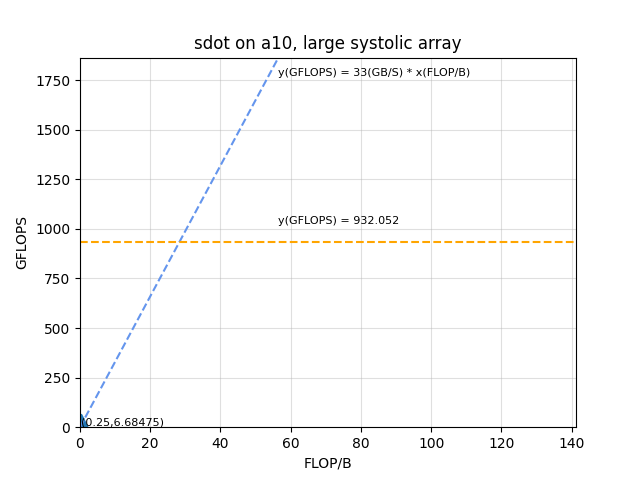

# Dot Product

This design demonstrates the following dot product between two vectors:

$$
result \longleftarrow op_3(op_1(\vec{x})\cdot op_2(\vec{y}))
$$

where $op_1(\vec{x})$ is $\vec{x}$ or $\overline{\vec{x}}$ , $op_2(y)$ is $\vec{y}$ or $\text{sign}(\vec{y})$ , $op_3(v)$ is $v$ or $\sqrt{v}$, and $\vec{x}$ and $\vec{y}$ are vectors. The definition of $\text{sign}$ is as follows

* if $\vec{y}$ is a real vector, $\text{sign}(\vec{y})$ results in a real vector, and $\text{sign}(\vec{y})_i$ is 1 (-1) if $y_i$ is positive (negative).

* if $\vec{y}$ is a complex vector, $\text{sign}(\vec{y})$ results in a complex vector, and $Re(\text{sign}(\vec{y})_i)$ is 1 (-1) if $Re(\vec{y}_i)$ is positive (negative), $Im(\text{sign}(\vec{y})_i)$ is -1 (1) if $Im(\vec{y}_i)$ is postive (negative).

The design has static and dynamic parameters. The static parameters include

* data types: the type of the inputs and result, denoted `ITYPE` and `TTYPE` respectively, A data type can be any of `s` (single precision), `d` (double precision), `c` (complex single precision), and `z` (complex double precision).

* [sizes of the systolic array](#user-content-sizes-of-a-systolic-array) that is expressed by the design.

For each combination of the static parameters, the design needs to be synthesized once.

Once the design is synthesized, the dynamic parameters are passed in and control its execution:

* `ConjugateX`, `IncX`

* `SignBitY`, `IncY`

* `SqrtRet`

where

* `ConjugateX`: is vector X to be conjugated?

* `SignBitY`: is vector Y to be applied with the `sign` function mentioned above?

* `SqrtRet`: is the result to be square-rooted?

* `IncX`, `IncY`: strides of the input vectors.

Through APIs that provide appropriate dynamic parameters and post-processing, a synthesized design simulates the following standard BLAS kernels:

* `DOT` - Computes the dot product of two real vectors.

* `DOTU` - Computes the dot product of two complex vectors.

* `DOTC` - Computes the dot product of two complex vectors, conjugating the first vector.

* `SDSDOT` - Computes a vector-vector dot product with double precision.

* `NRM2` - Computes the Euclidean norm of a vector.

* `ASUM` - Computes the sum of magnitudes of the vector elements.

| Area                | Description                                                                   |
| ------------------- | ----------------------------------------------------------------------------- |
| What you will learn | How to implement a high performance systolic array for dot product on an FPGA |
| Time to complete    | ~1 hr (excluding compile time)                                                |
| Category            | Reference Designs and End to End                                              |

## Prerequisites

| Optimized for | Description                                                                                                                                                                                           |
| ------------- | ----------------------------------------------------------------------------------------------------------------------------------------------------------------------------------------------------- |
| OS            | Ubuntu* 18.04/20.04 (The design is not really specific to any OS. Other Linux distributions or Windows might also work, although not tested)                                                          |
| Hardware      | Intel® Programmable Acceleration Card with Intel® Arria® 10 GX FPGA (Intel® PAC with Intel® Arria® 10 GX FPGA)<br/>Intel® FPGA Programmable Acceleration Card (PAC) D5005 (with Intel Stratix® 10 SX) |
| Software      | Intel® oneAPI DPC++/C++ Compiler 2023.2<br/>BSP used for Arria® 10 FPGA: inteldevstack/a10_gx_pac_ias_1_2_1_pv/opencl/opencl_bsp<br/>T2SP compiler (a beta version is pre-installed)                  |

## The design

In this design, the input vectors are pre-processed on the host so that the FPGA device loads data sequentially from the device DRAM. This ensures that the memory accesses won't be a bottleneck of the performance. In pre-processing, the host reads an input vector $V$ and apply $op_1/op_2$ to it. The resulting $op_1(\vec{x})$ and $op_2(\vec{y})$ are sent to the device DRAM sequentially, and their inner product is computed by a single PE on the device.

Each cycle, the PE fetches KKK elements of $op_1(\vec{x})$ and $op_2(\vec{y})$ from DRAM, calculates their inner product, and stores the result in the shift register. Finally these registers are summed up to get the final result.

When the length of the input vector is not a multiple of the number of PEs, zeros are automatically inserted. This is zero-padding.


### Sizes of a systolic array

* `KKK` - SIMD lanes in a PE: every cycle, the PE computes a dot product, in a vectorized way, between `KKK` numbers of data from $op_1(\vec{x})$ and `KKK` numbers of data from $op_2(\vec{y})$.

* `KK` - The number of shift registers.

#### Restrictions

* Data sizes: For memory efficiency, the vectors must be loaded in vectors from the device memory. Therefore, the width of $op_1(\vec{x})$ and $op_2(\vec{y})$ must be multiples of  `KKK`.

The [parameters.h](./parameters.h) file pre-defines the sizes for a tiny and large systolic array. The tiny configuration specifies a systolic array with 4 PEs. The large configuration tries to maximally utilize resources, and varies with precision and hardware. One can modify these parameters. If so, please remember to modify the `get_systolic_array_dimensions()` function in [api.hpp](./api.hpp) accordingly.

## Build and test

Follow the [general instructions](../README.md#user-content-build-a-kernel-and-run-on-Linux) to build a demo application `demo_VARIATION_SIZE_HW`for any kernel `VARIATION` that is covered by the design with a systolic array of any `SIZE` (`tiny` or `large`) on any `HW` (`a10` or `s10`), and the design will be synthesized under the hood into an image and  linked with that kernel. The correspondence between VARIATION and image, and the current status, are as follows:

| VARIATION of a kernel      | Image      | Correctness | Performance |
| -------------------------- | ---------- | ----------- | ----------- |
| sdot, snrm2, sasum         | sdotprod   | ✓           | ✓           |
| ddot, dnrm2, dasum         | ddotprod   | ✓           | ✓           |
| cdotu, cdotc               | cdotprod   | ✓           | tuning      |
| zdotu, zdotc               | zdotprod   | ✓           | tuning      |
| scnrm2, scasum             | cdotprod   | ✓           | tuning      |
| dznrm2, dzasum             | zdotprod   | ✓           | tuning      |
| sdsdot                     | sdsdotprod | ✓           | ✓           |
| dsdot                      | dsdotprod  | ✓           | tuning      |
 

For example,

```shell
cd blas/dot/build
cmake ..
make demo_sdot_large_a10
```

will automatically synthesize this design into an image `blas/reconfigurable_dotprod/bin/sdotprod_large_a10.a`, and link the image into the demo application `blas/dot/bin/demo_sdot_large_a10`. Here `large_a10` refers to the large-sized configuration defined for A10 FPGA in [parameters.h](./parameters.h).

Alternatively, one can install the pre-synthesized bitstreams and demo applications following the general instructions.

Running a demo application will generate performance metrics.

## Metrics

Note: For the mixed-precision kernel, since our implementation is to perform precision conversion on the host, its performance should be similar to that of the kernel with the same calculation precision, so it is no longer listed in the table.

<table style="width:120%">
<tr>
    <th>Device</th>
    <th>Static parameters<br>(ITYPE, TTYPE<br>KKK, KK)</th>
    <th>Logic utilization</th>
    <th>DSP blocks</th>
    <th>RAM blocks</th>
    <th>Frequency<br>(MHZ)</th>
    <th>Throughput<br>(GFLOPS)</th>
    <th>Vector Size<br>(X, Y)</th>
    <th>Command to reproduce</th>
</tr>
<tr>
    <td rowspan="4">Intel Arria 10 GX 1150</td>
    <td>S, S<br>64, 16</td>
    <td>84,843 / 427,200 ( 20 % )</td>
    <td>84 / 1,518 ( 6 % )</td>
    <td>426 / 2,713 ( 16 % )</td>
    <td>307</td>
    <td>6.5</td>
    <td>64M, 64M</td>
    <td>blas/dot/bin/demo_sdot_large_a10.unsigned</td>
</tr>
<tr>
    <td>D, D<br>64, 8</td>
    <td>128,141 / 427,200 ( 30 % )</td>
    <td>44 / 1,518 ( 3 % )</td>
    <td>434 / 2,713 ( 16 % )</td>
    <td>303</td>
    <td>3.1</td>
    <td>32M, 32M</td>
    <td>blas/dot/bin/demo_ddot_large_a10.unsigned</td>
</tr>
<tr>
    <td>C, C<br>64, 8</td>
    <td>158,786 / 427,200 ( 37 % )</td>
    <td>181 / 1,518 ( 12 % )</td>
    <td>1,277 / 2,713 ( 47 % )</td>
    <td>182</td>
    <td>0.3</td>
    <td>32M, 32M</td>
    <td>blas/dotu/bin/demo_cdotu_large_a10.unsigned</td>
</tr>
<tr>
    <td>Z, Z<br>32, 4</td>
    <td>171,737 / 427,200 ( 40 % )</td>
    <td>185 / 1,518 ( 12 % )</td>
    <td>1,069 / 2,713 ( 39 % )</td>
    <td>200</td>
    <td>0.4</td>
    <td>16M, 16M</td>
    <td>blas/dotu/bin/demo_zdotu_large_a10.unsigned</td>
</tr>
<tr>
    <td rowspan="4">Intel Stratix 10 GX 2800</td>
    <td>S, S<br></td>
    <td></td>
    <td></td>
    <td></td>
    <td></td>
    <td></td>
    <td></td>
    <td></td>
</tr>
<tr>
    <td>D, D<br></td>
    <td></td>
    <td></td>
    <td></td>
    <td></td>
    <td></td>
    <td></td>
    <td></td>
</tr>
<tr>
    <td>C, C<br></td>
    <td></td>
    <td></td>
    <td></td>
    <td></td>
    <td></td>
    <td></td>
    <td></td>
</tr>
<tr>
    <td>Z, Z<br></td>
    <td></td>
    <td></td>
    <td></td>
    <td></td>
    <td></td>
    <td></td>
    <td></td>
</tr>

</table>

## Roofline


