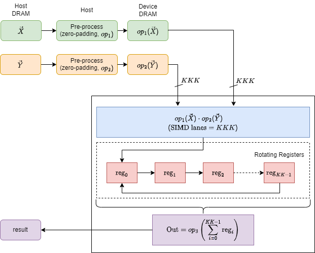
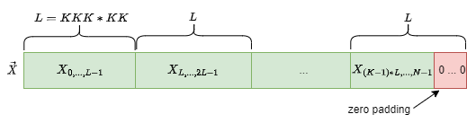

# Dot Product

This design demonstrates the following dot product between two vectors:

$$
result \longleftarrow op_3(op_1(\vec{x})\cdot op_2(\vec{y}))
$$

where $op_1(\vec{x})$ is $\vec{x}$ or $\overline{\vec{x}}$ , $op_2(y)$ is $\vec{y}$ or $\text{sign}(\vec{y})$ , $op_3(v)$ is $v$ or $\sqrt{v}$, and $\vec{x}$ and $\vec{y}$ are vectors. The definition of $\text{sign}$ is as follows

* if $\vec{y}$ is a real vector, $\text{sign}(\vec{y})$ results in a real vector, and $\text{sign}(\vec{y})_i$ is 1 (-1) if $y_i$ is positive (negative).

* if $\vec{y}$ is a complex vector, $\text{sign}(\vec{y})$ results in a complex vector, and $Re(\text{sign}(\vec{y})_i)$ is 1 (-1) if $Re(\vec{y}_i)$ is positive (negative), $Im(\text{sign}(\vec{y})_i)$ is -1 (1) if $Im(\vec{y}_i)$ is postive (negative).

The design has static and dynamic parameters. The static parameters include

* data types: the type of the result and inputs, denoted `TTYPE` and `ITYPE`, respectively. A data type can be any of `s` (single precision), `d` (double precision), `c` (complex single precision), and `z` (complex double precision).

* [sizes of the systolic array](#user-content-sizes-of-a-systolic-array) that is expressed by the design.

For each combination of the static parameters, the design needs to be synthesized once.

Once the design is synthesized, the dynamic parameters are passed in and control its execution:

* `ConjugateX`, `IncX`

* `SignBitY`, `IncY`

* `SqrtRet`

where

* `ConjugateX`: is vector X to be conjugated?

* `SignBitY`: is vector Y to be applied with the `sign` function mentioned above?

* `SqrtRet`: is the result to be square-rooted?

* `IncX`, `IncY`: strides of the input vectors.

Through APIs that provide appropriate dynamic parameters and post-processing, a synthesized design simulates the following standard BLAS kernels:

* `DOT` - Computes the dot product of two real vectors.

* `DOTU` - Computes the dot product of two complex vectors.

* `DOTC` - Computes the dot product of two complex vectors, conjugating the first vector.

* `SDSDOT` - Computes a vector-vector dot product with double precision.

* `NRM2` - Computes the Euclidean norm of a vector.

* `ASUM` - Computes the sum of magnitudes of the vector elements.

| Area                | Description                                                                   |
| ------------------- | ----------------------------------------------------------------------------- |
| What you will learn | How to implement a high performance systolic array for dot product on an FPGA |
| Time to complete    | ~1 hr (excluding compile time)                                                |
| Category            | Reference Designs and End to End                                              |

## Prerequisites

| Optimized for | Description                                                                                                                                                                                           |
| ------------- | ----------------------------------------------------------------------------------------------------------------------------------------------------------------------------------------------------- |
| OS            | Ubuntu* 18.04/20.04 (The design is not really specific to any OS. Other Linux distributions or Windows might also work, although not tested)                                                          |
| Hardware      | Intel® Programmable Acceleration Card with Intel® Arria® 10 GX FPGA (Intel® PAC with Intel® Arria® 10 GX FPGA)<br/>Intel® FPGA Programmable Acceleration Card (PAC) D5005 (with Intel Stratix® 10 SX) |
| Software      | Intel® oneAPI DPC++/C++ Compiler 2023.2<br/>BSP used for Arria® 10 FPGA: inteldevstack/a10_gx_pac_ias_1_2_1_pv/opencl/opencl_bsp<br/>T2SP compiler (a beta version is pre-installed)                  |

## The design

Dot product has no data reuse. A data is loaded and then used only once. Thus the performance is bound by the bandwidth of the FPGA DRAM. The key to achieve high performance is to effectively utilize the bandwidth.

In this design, the input vectors are pre-processed on the host: the data of the vectors are loaded in the order they are to be used, transformed by $op_1/op_2$, and sent to the device DRAM sequentially. Then the FPGA device simply loads data from the device DRAM sequentially.

The device divides the input data into `parts`, and calculates the dot product of each part with a dot product engine, interleavingly: there is no dependence between the parts, and thus they can be processed independently; however, it is unecessary to process them in parallel on multiple dot product engines, because the performance is limited by the memory anyway; therefore, we let all the parts time-share a single dot product engine.

More specifically, the input vectors $op_1(\vec{x})$ and $op_2(\vec{y})$ are loaded from the device DRAM in short vectors of size `KKK`. Each time, a `pair` of short vectors are loaded from the two input vectors. The pairs are divided between `KK` number of parts: the 1st, `KK+1`-th, ..., pair belong to the first part, the 2nd, `KK+2`-th, ..., pair belong to the second part, and so on.

The dot product engine reduces a pair each time. The engine is a systolic array of PEs (processing elements) that run synchronously in SIMD style. The engine reduces a pair that belongs to the first part, then reduces a pair that belongs to the second part, ... Then the engine reduces the next pair that belong to the first part, then reduces the next pair that belongs to the second part, ... This process repeats until all the parts are fully reduced. Before that, the intermediate result of each part is stored in a register.

There are totally `KK` intermediate results, and their corresponding `KK` registers are chained into a circle. These registers rotate: for the part currently under reduction, the engine reads its intermediate result from register 0, adds it up with the dot product of a new pair, writes the new result back to register 0, and rotates the registers once. By rotation, the values in register 0, 1, ..., are fowarded to register 1, 2, ..., and the last register's value, which is the intermediate result of the next part to reduce, is forwarded to register 0. The rotating registers are automatically constructed by the T2SP compiler.

After all the parts are fully reduced, their results, stored in these registers, are summed up to get the final result.


Note: in pre-processing, due to the way the inputs are to be divided, when the length of an input vector is not a multiple of `KKK * KK`, zeros are automatically inserted. This is zero-padding, as illustrated below for vector $\vec{x}$:



### Sizes of a systolic array

* `KKK` - total PEs, i.e. SIMD lanes.

* `KK` - The number of rotating registers.

#### Restrictions

* Data sizes: For memory efficiency, the input vectors must be loaded in short vectors from the device memory. Therefore, the width of $\vec{x}$ and $\vec{y}$ must be multiples of  `KKK`.

The [parameters.h](./parameters.h) file pre-defines the sizes for a tiny and large systolic array. The tiny configuration specifies a systolic array with 4 PEs. The large configuration tries to maximally utilize resources, and varies with precision and hardware. One can modify these parameters. If so, please remember to modify the `get_systolic_array_dimensions()` function in [api.hpp](./api.hpp) accordingly.

## Build and test

Follow the [general instructions](../README.md#user-content-build-a-kernel-and-run-on-Linux) to build a demo application `demo_VARIATION_SIZE_HW`for any kernel `VARIATION` that is covered by the design with a systolic array of any `SIZE` (`tiny` or `large` as defined in [parameters.h](./parameters.h)) on any `HW` (`a10` or `s10`), and the design will be synthesized under the hood into an image and  linked with that kernel. The correspondence between VARIATION and image, and the current status, are as follows:

| VARIATION of a kernel      | Image      | Correctness | Performance |
| -------------------------- | ---------- | ----------- | ----------- |
| sdot, snrm2, sasum         | sdotprod   | ✓           | ✓           |
| ddot, dnrm2, dasum         | ddotprod   | ✓           | ✓           |
| cdotu, cdotc               | cdotprod   | ✓           | tuning      |
| zdotu, zdotc               | zdotprod   | ✓           | tuning      |
| scnrm2, scasum             | cdotprod   | ✓           | tuning      |
| dznrm2, dzasum             | zdotprod   | ✓           | tuning      |
| sdsdot                     | sdsdotprod | ✓           | ✓           |
| dsdot                      | dsdotprod  | ✓           | tuning      |


For example,

```shell
cd blas/dot/build
cmake ..
make demo_sdot_large_a10
```

will automatically synthesize this design into an image `blas/reconfigurable_dotprod/bin/sdotprod_large_a10.a`, and link the image into the demo application `blas/dot/bin/demo_sdot_large_a10`.

Alternatively, one can install the pre-synthesized bitstreams following the general instructions.

Running a demo application will generate performance metrics.

## Metrics

<table style="width:120%">
<tr>
    <th>Device</th>
    <th>Static parameters<br>(TTYPE, ITYPE<br>KKK, KK)</th>
    <th>Logic utilization</th>
    <th>DSP blocks</th>
    <th>RAM blocks</th>
    <th>Frequency<br>(MHZ)</th>
    <th>Throughput</th>
    <th>Vector Size<br>(X, Y)</th>
    <th>Command to reproduce</th>
</tr>
<tr>
    <td rowspan="5">Intel Arria 10 GX 1150</td>
    <td>S, S<br>16, 64</td>
    <td>82,366 / 427,200 ( 19 % )</td>
    <td>20 / 1,518 ( 1 % )</td>
    <td>425 / 2,713 ( 16 % )</td>
    <td>312</td>
    <td>5.8 GFLOPS<br>(68% peak)</td>
    <td>256M, 256M</td>
    <td>blas/dot/bin/demo_sdot_large_a10.unsigned</td>
</tr>
<tr>
    <td>D, S<br></td>
    <td>90,478 / 427,200 ( 21 % )</td>
    <td>44 / 1,518 ( 3 % )</td>
    <td>437 / 2,713 ( 16 % )</td>
    <td>260</td>
    <td>2.9 GFLOPS<br>(34% peak)</td>
    <td>128M, 128M</td>
    <td>blas/dot/bin/demo_dsdot_large_a10.unsigned</td>
</tr>
<tr>
    <td>D, D<br>8, 64</td>
    <td>128,141 / 427,200 ( 30 % )</td>
    <td>44 / 1,518 ( 3 % )</td>
    <td>434 / 2,713 ( 16 % )</td>
    <td>303</td>
    <td>2.9 GFLOPS<br>(67% peak)</td>
    <td>128M, 128M</td>
    <td>blas/dot/bin/demo_ddot_large_a10.unsigned</td>
</tr>
<tr>
    <td>C, C<br>8, 64</td>
    <td>89,908 / 427,200 ( 21 % )</td>
    <td>186 / 1,518 ( 12 % )</td>
    <td>450 / 2,713 ( 17 % )</td>
    <td>310</td>
    <td>13.4 GFLOPS<br>(79% peak)</td>
    <td>32M, 32M</td>
    <td>blas/dotu/bin/demo_cdotu_large_a10.unsigned</td>
</tr>
<tr>
    <td>Z, Z<br>4, 32</td>
    <td>145,522 / 427,200 ( 34 % )</td>
    <td>185 / 1,518 ( 12 % )</td>
    <td>491 / 2,713 ( 18 % )</td>
    <td>271</td>
    <td>6.5 GFLOPS<br>(76% peak)</td>
    <td>16M, 16M</td>
    <td>blas/dotu/bin/demo_zdotu_large_a10.unsigned</td>
</tr>
<tr>
    <td rowspan="5">Intel Stratix 10 SX 2800</td>
    <td>S, S<br></td>
    <td></td>
    <td></td>
    <td></td>
    <td></td>
    <td></td>
    <td></td>
    <td></td>
</tr>
<tr>
    <td>D, D<br></td>
    <td></td>
    <td></td>
    <td></td>
    <td></td>
    <td></td>
    <td></td>
    <td></td>
</tr>
<tr>
    <td>D, S<br></td>
    <td></td>
    <td></td>
    <td></td>
    <td></td>
    <td></td>
    <td></td>
    <td></td>
</tr>
<tr>
    <td>C, C<br></td>
    <td></td>
    <td></td>
    <td></td>
    <td></td>
    <td></td>
    <td></td>
    <td></td>
</tr>
<tr>
    <td>Z, Z<br></td>
    <td></td>
    <td></td>
    <td></td>
    <td></td>
    <td></td>
    <td></td>
    <td></td>
</tr>

</table>

### Performance analysis

Theoretical peak performance of dot product, for the cases of SS:DS:DD:CC:ZZ, equals 8.5 : 8.5 : 4.3 : 17 : 8.5 GFLOPS for A10, and 19.2 : 19.2 : 9.6 : 38.4 : 19.2 GFLOPS for S10. The performance is derived as follows:

* Theoretical peak performance of dot product = (FPGA DRAM bandwidth in GB/s) * (#FLOPS per byte)
    * Memory bandwidth is 34.133 GB/s for A10 and 76.800 GB/s for S10.
    * #FLOPS per byte for SS:DS:DD:CC:ZZ= 1/4 : 1/4 : 1/8 : 1/2 : 1/4
        * In dot product, a MAD is applied to 2 input data.
        * FLOPS (FP operations) per MAD for SS:DS:DD:CC:ZZ=2:2:2:8:8
            * FLOPS (FP operations) are either single or double precision. One MAD includes one FP MUL and one FP ADD.
            * Adding two complex numbers requires 2 FP ADDs. Multiplying two complex numbers requires 4 FP MULs and 2 FP ADDs.
        * Bytes of two input data for the cases SS:DS:DD:CC:ZZ=8:8:16:16:32