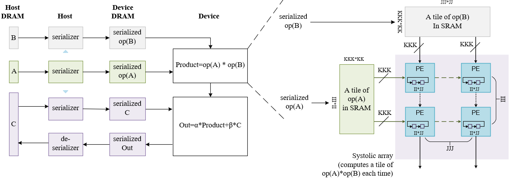

# Matrix Multiplication

This design demonstrates the following matrix-matrix product:

$C \longleftarrow \alpha * op(A) * op(B) + \beta * C$

where $op(X)$ is $X$, $X^T$, or $X^H$, $alpha$ and $beta$ are scalars, and $A$, $B$ and $C$ are matrices.

The design has static and dynamic parameters. The static parameters include
* data types of the matrices and the scalars, including `TA`, `TB`, `TC` and `TS` for the data types of matrix `A`, `B`, `C` and the scalars, respectively. A data type can be any of `S` (single precision), `D` (double precision), `C` (complex single precision), `Z` (complex double precision), and in future, `bfloat16` etc.
* sizes of the systolic array, to be described [below](#sizes_matmul_systolic_array).
  
For each supported combination of the static parameters, the design needs to be synthesized once.

The dynamic parameters are passed into one synthesized design, and control its execution. They include the following:
* `TransposeA`, `ConjugateA`, `SymmetricA`, `HermitianA`, `UpA`
* `TransposeB`, `ConjugateB`, `SymmetricB`, `HermitianB`, `UpB`
* `SymmetricC`, `HermitianC`, `UpC`
* `HalfSpaceOut`
* `alpha`, `beta`

where

* `TransposeX`, `ConjugateX`: Is matrix X to be transposed? Is it to be conjugated?
* `SymmetricX`, `HermitianX`: Is matrix X symmetric? Is it Hermitian?
* `UpX`: Given matrix X as symmetric or Hermitian, is its upper triangle stored?
* `HalfSpaceOut`: Compute only half of the output matrix? This is true when the output is symmetric or Hermitian. In this case, the design computes only the upper triangle of the output, in terms of tiles. For the tiles crossing the diagonal, we ensure the correctness of only their data above or on the diagonal.

Through APIs that provide appropriate dynamic parameters and post-processing, a synthesized design simulates the following standard BLAS kernels:
* `GEMM` - Computes a matrix-matrix product with general matrices.
* `SYMM` - Computes a matrix-matrix product where one input matrix is symmetric and one matrix is general.
* `HEMM` - Computes a matrix-matrix product where one input matrix is Hermitian and one matrix is general.
* `SYRK` - Performs a rank-k update of the upper or lower triangle of a symmetric matrix.
* `HERK` - Performs a rank-k update of the upper or lower triangle of a Hermitian matrix.

In other words, the design is dynamically reconfigurable.


Note:
* `SYRK` and `HERK` are to be available in the next release

| Area                | Description                                                  |
| ------------------- | ------------------------------------------------------------ |
| What you will learn | How to implement a high performance systolic array for matrix multiplication on an FPGA |
| Time to complete    | ~1 hr (excluding compile time)                               |
| Category            | Reference Designs and End to End                             |

## Prerequisites
| Optimized for        | Description
|:---                  |:---
| OS                   | Ubuntu* 18.04/20.04 (Other Linux distributions or Windows might also work, although not tested)
| Hardware             | Intel® Programmable Acceleration Card with Intel® Arria® 10 GX FPGA (Intel® PAC with Intel® Arria® 10 GX FPGA) <br> Intel® FPGA Programmable Acceleration Card (PAC) D5005 (with Intel Stratix® 10 SX)
| Software             | Intel® oneAPI DPC++/C++ Compiler 2023.2<br> BSP used for Arria® 10 FPGA: inteldevstack/a10_gx_pac_ias_1_2_1_pv/opencl/opencl_bsp<br>T2SP compiler (a beta version is pre-installed)

## The design
In this design, the input/output matrices are pre/post-processed on the host so that the FPGA device loads/stores data sequentially from/to the device DRAM. This ensures that the memory accesses won't be a bottleneck of the performance. In pre-processing, the host reads an input matrix $X$ in such a way that in effect, the elements of $op(X)$ are read in the order they are to used in the computation, and sent sequentially to the device. This is called serialization.

To allow arbitrarily large matrices, as long as they can fit in the host and device DRAM, the matrices are tiled. Every time, a tile of matrix $op(A)$ and a tile of matrix $op(B)$ are fetched into the device SRAM. The product of two input tiles is calculated by a systolic array, and is used to update a tile of the product $op(A)*op(B)$. The product tile is divided by the PEs (processing elements) of the systolic array. Each PE works on a part of the product tile, storing them in rotating registers.

When the dimensions of an input matrix $op(X)$ are not divisible by the dimension of a tile of the matrix, zeros are automatically inserted into the serialized data stream of the matrix. This is called zero-padding.

Similary, when the dimensions of the product matrix $op(A)*op(B)$ are not divisible by the dimension of a tile of the product matrix, extraneous data are automatically removed from the serialized data stream of the matrix.



<a name="sizes_matmul_systolic_array">Sizes of a systolic array</a>:
* `KKK` - SIMD lanes in a PE: every cycle, the PE computes a dot product, in a vectorized way, between `KKK` number of data from a row of $op(A)$ and `KKK` number of data from a column of $op(B)$.
* `JJJ` - Columns of the systolic array.
* `III` - Rows of the systolic array.
* `JJ ` - Columns of matrix $op(B)$ to process in a PE
* `II ` - Rows of matrix $op(A)$ to process in a PE. There are `II*JJ` elements in the product matrix $op(A)*op(B)$ for the PE to reduce.
* `KK ` - `KKK * KK` is the columns of matrix A / rows of matrix B to reduce in a PE.

The [parameters.h](./parameters.h) file provides pre-defined sizes for a tiny and large systolic array. The tiny configuration specifies a 4x4 systolic array, with each PE computing 16 results. The large configuration tries to maximize the utilization of resources, and varies with precision and hardware. One can modify these parameters. If so, please remember to modify the `get_systolic_array_dimensions()` function in [api.hpp](./api.hpp) accordingly.

## Build, test, and clean
Follow the [general instructions](../README.md#Build-a-kernel-and-run-on-Linux) to build a demo application `demo_KERNEL_SIZE_HW`for any `KERNEL` that is covered by the design with a systolic array of any `SIZE` (`tiny` or `large`) on any `HW` (`a10` or `s10`), and the design will be synthesized automatically into an image and linked with that kernel. The correspondence between KERNEL and image, and the current status, are as follows:

<table>
<tr>
    <th>KERNEL</th>
    <th>Image</th>
    <th>Correctness</th>
    <th>Performance</th>
</tr>
<tr>
    <td>sgemm, ssymm, ssyrk</td>
    <td>ssssmatmul</td>
    <td>&#x2713;</td>
    <td>&#x2713;</td>
</tr>
<tr>
    <td>dgemm, dsymm, dsyrk</td>
    <td>ddddmatmul</td>
    <td>&#x2713;</td>
    <td>&#x2713;</td>
</tr>
<tr>
    <td>cgemm, csymm, csyrk, chemm</td>
    <td>ccccmatmul</td>
    <td>&#x2713;</td>
    <td>tuning</td>
</tr>
<tr>
    <td>zgemm, zsymm, zsyrk, zhemm</td>
    <td>zzzzmatmul</td>
    <td>&#x2713;</td>
    <td><a href="https://github.com/haoxiaochen/t2sp/issues/33">synthesis failure</a></td>
</tr>
<tr>
    <td>cherk</td>
    <td>cccsmatmul</td>
    <td>onging</td>
    <td></td>
</tr>
<tr>
    <td>zherk</td>
    <td>zzzdmatmul</td>
    <td>ongoing</td>
    <td></td>
</tr>
</table>

Here the prefix `ssss` etc. refers to the data types of `TA`, `TB`, `TC` and `TS`.

For example,

```
    cd productive_libraries/blas/gemm/build
    cmake ..
    make demo_sgemm_large_a10
```

will automatically synthesize this design into an image `ssssmatmul_large_a10.a` under `productive_libraries/blas/reconfigurable_matmul/bin` directory, and link the image with the demo application for `sgemm`. Here `large_a10` refers to the large-sized configuration defined for A10 FPGA in [parameters.h](./parameters.h).

Alternatively, one can install the pre-synthesized bitstreams and demo applications following the general instructions.

Running a demo application will generate performance metrics.

## Metrics

<table style="width:120%">
<tr>
    <th>Device</th>
    <th>Static parameters<br>(TA, TB, TC, TS)</th>
    <th>Dynamic parameters<br>(KKK, JJJ, III, JJ, II, KK)</th>
    <th>Logic utilization</th>
    <th>DSP blocks</th>
    <th>RAM blocks</th>
    <th>Frequency<br>(MHZ)</th>
    <th>Throughput<br>(GOPS)</th>
    <th>Matrix Size<br>(A, B)</th>
    <th>Command to reproduce</th>
</tr>
<tr>
    <td rowspan="6">Intel Arria 10 GX 1150</td>
    <td>S, S, S, S</td>
    <td>16, 8, 10, 32, 32, 32</td>
    <td>216,823 / 427,200 ( 51 % )</td>
    <td>1,311 / 1,518 ( 86 % )</td>
    <td>2,205 / 2,713 ( 81 % )</td>
    <td>217</td>
    <td>554</td>
    <td>10K * 16K, 16K * 8K</td>
    <td>gemm/bin/demo_sgemm_large_a10</td>
</tr>
<tr>
    <td>D, D, D, D</td>
    <td>8, 4, 6, 32, 32, 32</td>
    <td>312,330 / 427,200 ( 73 % )</td>
    <td>807 / 1,518 ( 53 % )</td>
    <td>1,494 / 2,713 ( 55 % )</td>
    <td>238</td>
    <td>91</td>
    <td>6K*8K, 8K*4K</td>
    <td>gemm/bin/demo_dgemm_large_a10</td>
</tr>
<tr>
    <td>C, C, C, C</td>
    <td></td>
    <td></td>
    <td></td>
    <td></td>
    <td></td>
    <td></td>
    <td></td>
    <td></td>
</tr>
<tr>
    <td>Z, Z, Z, Z</td>
    <td></td>
    <td></td>
    <td></td>
    <td></td>
    <td></td>
    <td></td>
    <td></td>
    <td></td>
</tr>
<tr>
    <td>C, C, C, S</td>
    <td></td>
    <td></td>
    <td></td>
    <td></td>
    <td></td>
    <td></td>
    <td></td>
    <td></td>
</tr>
<tr>
    <td>Z, Z, Z, D</td>
    <td></td>
    <td></td>
    <td></td>
    <td></td>
    <td></td>
    <td></td>
    <td></td>
    <td></td>
</tr>
<tr>
    <td rowspan="6">Intel Stratix 10 GX 2800</td>
    <td>S, S, S, S</td>
    <td>16, 16, 10, 32, 32, 32</td>
    <td>580,648 / 933,120 ( 62 % )</td>
    <td>2,597 / 5,760 ( 45 % )</td>
    <td>3,712 / 11,721 ( 32 % )</td>
    <td>238</td>
    <td>882</td>
    <td>10K*16K, 16K*16K</td>
    <td>gemm/bin/demo_sgemm_large_s10</td>
</tr>
<tr>
    <td>D, D, D, D</td>
    <td>8, 4, 6, 32, 32, 32</td>
    <td>581,320 / 933,120 ( 62 % )</td>
    <td>805 / 5,760 ( 14 % )</td>
    <td>1,927 / 11,721 ( 16 % )</td>
    <td>265</td>
    <td>74</td>
    <td>6K*8K, 8K*4K</td>
    <td>gemm/bin/demo_dgemm_large_s10</td>
</tr>
<tr>
    <td>C, C, C, C</td>
    <td></td>
    <td></td>
    <td></td>
    <td></td>
    <td></td>
    <td></td>
    <td></td>
    <td></td>
</tr>
<tr>
    <td>Z, Z, Z, Z</td>
    <td></td>
    <td></td>
    <td></td>
    <td></td>
    <td></td>
    <td></td>
    <td></td>
    <td></td>
</tr>
<tr>
    <td>C, C, C, S</td>
    <td></td>
    <td></td>
    <td></td>
    <td></td>
    <td></td>
    <td></td>
    <td></td>
    <td></td>
</tr>
<tr>
    <td>Z, Z, Z, D</td>
    <td></td>
    <td></td>
    <td></td>
    <td></td>
    <td></td>
    <td></td>
    <td></td>
    <td></td>
</tr>

</table>
