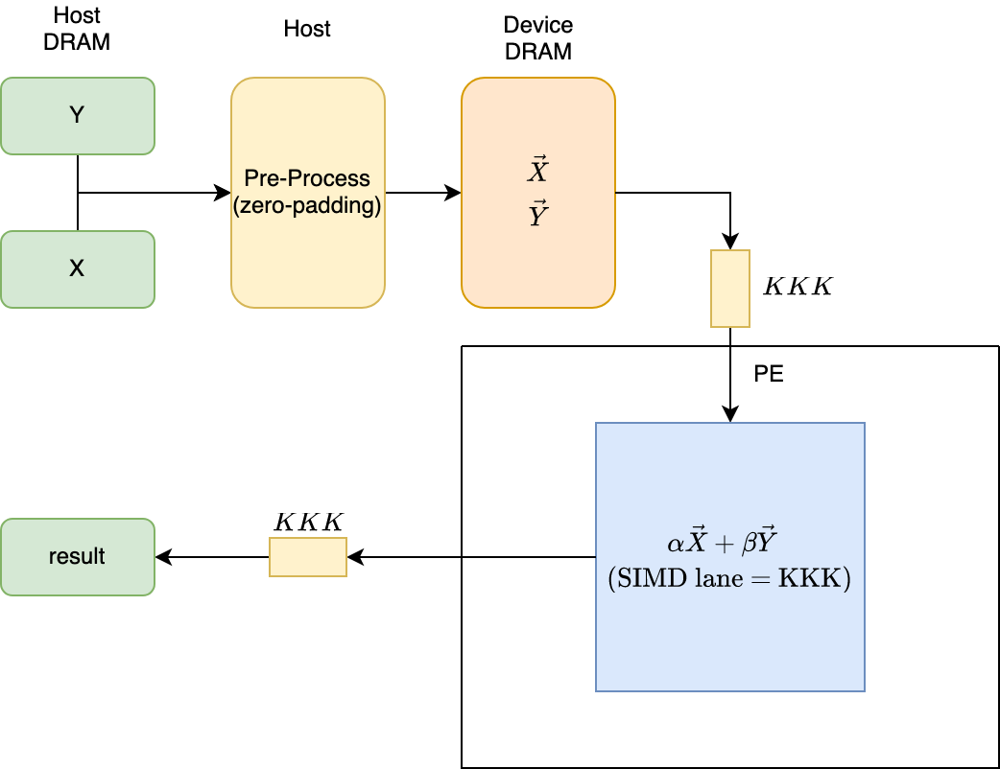
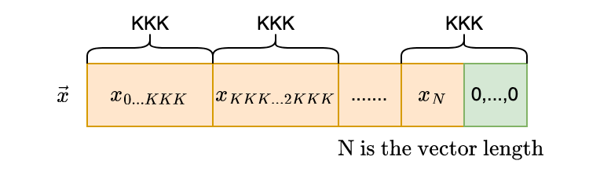

# Vector Addition

This design demonstrates the following addition of two vectors:

$$
result \longleftarrow \alpha * \vec{x} + \beta * \vec{y}
$$

where $\alpha$ and $\beta$ are scalars, and $\vec{x}$ and $\vec{y}$ are vectors.

The design has static and dynamic parameters. The static parameters include

* data type of the vectors, denoted `TTYPE`. In this release, the scalars' type is the same as the vectors' type. A data type can be any of `s` (single precision), `d` (double precision), `c` (complex single precision), and `z` (complex double precision).

* [sizes of the systolic array](#user-content-sizes-of-a-systolic-array) that is expressed by the design.

For each combination of the static parameters, the design needs to be synthesized once.

Once the design is synthesized, the dynamic parameters are passed in and control its execution:

* `IncX`, `IncY`: strides of the input vectors.

* `Alpha`, `Beta`: the input scalars.

Through APIs that provide appropriate dynamic parameters and post-processing, a synthesized design simulates the following standard BLAS kernels:

* `AXPY` - Computes a vector-scalar product and adds the result to a vector.

* `SCAL` - Computes the product of a vector by a scalar.

* `COPY` - Copies a vector to another vector.

| Area                | Description                                                                       |
| ------------------- | --------------------------------------------------------------------------------- |
| What you will learn | How to implement a high performance systolic array for vector addition on an FPGA |
| Time to complete    | ~1 hr (excluding compile time)                                                    |
| Category            | Reference Designs and End to End                                                  |

## Prerequisites

| Optimized for | Description                                                                                                                                                                                           |
| ------------- | ----------------------------------------------------------------------------------------------------------------------------------------------------------------------------------------------------- |
| OS            | Ubuntu* 18.04/20.04 (The design is not really specific to any OS. Other Linux distributions or Windows might also work, although not tested)                                                          |
| Hardware      | Intel® Programmable Acceleration Card with Intel® Arria® 10 GX FPGA (Intel® PAC with Intel® Arria® 10 GX FPGA)<br/>Intel® FPGA Programmable Acceleration Card (PAC) D5005 (with Intel Stratix® 10 SX) |
| Software      | Intel® oneAPI DPC++/C++ Compiler 2023.2<br/>BSP used for Arria® 10 FPGA: inteldevstack/a10_gx_pac_ias_1_2_1_pv/opencl/opencl_bsp<br/>T2SP compiler (a beta version is pre-installed)                  |

## The design

In this design, the input vectors are pre-processed on the host so that the FPGA device loads/stores data sequentially from/to the device DRAM. This ensures that the memory accesses won't be a bottleneck of the performance. In pre-processing, the host reads the values of the input vectors and sends the values to the device DRAM sequentially. The addition of the vectors is vectorized computed by a compute unit on the device.

When the length of the input vectors are not a multiple of the simd lane, zeros are automatically inserted. This is zero-padding.

Similarly, redundant zeros in the result are automatically removed.




### Sizes of a systolic array

* `KKK` - SIMD lanes in the compute unit: every cycle, the unit adds, in a vectorized way, `KKK` numbers of data from $\vec{x}$ and `KKK` numbers of data from $\vec{y}$.

#### Restrictions

* Data sizes: For memory efficiency, the vectors must be loaded and stored in vectors from/to the device memory. Therefore, the width of $\vec{x}$ and $\vec{y}$ must be a multiple of  `KKK`.

The [parameters.h](./parameters.h) file pre-defines the sizes for a tiny and large systolic array. The tiny configuration specifies a systolic array with 4 PEs. The large configuration tries to maximally utilize resources, and varies with precision and hardware. One can modify these parameters. If so, please remember to modify the `get_systolic_array_dimensions()` function in [api.hpp](./api.hpp) accordingly.

## Build and test

Follow the [general instructions](../README.md#user-content-build-a-kernel-and-run-on-Linux) to build a demo application `demo_VARIATION_SIZE_HW`for any kernel `VARIATION` that is covered by the design with a systolic array of any `SIZE` (`tiny` or `large`) on any `HW` (`a10` or `s10`), and the design will be synthesized under the hood into an image and  linked with that kernel. The correspondence between VARIATION and image, and the current status, are as follows:

| VARIATION of a kernel | Image   | Correctness | Performance |
| --------------------- | ------- | ----------- | ----------- |
| saxpy, sscal, scopy   | svecadd | ✓           | ✓           |
| daxpy, dscal, dcopy   | dvecadd | ✓           | ✓           |
| caxpy, cscal, ccopy   | cvecadd | ✓           | tuning      |
| zaxpy, zscal, zcopy   | zvecadd | ✓           | tuning      |

For example,

```shell
mkdir blas/axpy/build && cd blas/axpy/build
cmake ..
make demo_saxpy_large_a10
```

will automatically synthesize this design into an image `blas/reconfigurable_vecadd/bin/svecadd_large_a10.a`, and link the image into the demo application `blas/axpy/bin/demo_saxpy_large_a10`. Here `large_a10` refers to the large-sized configuration defined for A10 FPGA in [parameters.h](./parameters.h).

Alternatively, one can install the pre-synthesized bitstreams and demo applications following the general instructions.

Running a demo application will generate performance metrics.

## Metrics

<table style="width:120%">
<tr>
    <th>Device</th>
    <th>Static parameters<br>(TTYPE<br>KKK)</th>
    <th>Logic utilization</th>
    <th>DSP blocks</th>
    <th>RAM blocks</th>
    <th>Frequency<br>(MHZ)</th>
    <th>Throughput<br>(GFLOPS)</th>
    <th>Vector Size<br>(X, Y)</th>
    <th>Command to reproduce</th>
</tr>
<tr>
    <td rowspan="4">Intel Arria 10 GX 1150</td>
    <td>S, S<br>16</td>
    <td>80,715 / 427,200 ( 19 % )</td>
    <td>32 / 1,518 ( 2 % )</td>
    <td>446 / 2,713 ( 16 % )</td>
    <td>303</td>
    <td>4.5</td>
    <td>64M, 64M</td>
    <td>blas/dot/bin/demo_saxpy_large_a10.unsigned</td>
</tr>
<tr>
    <td>D, D<br>8</td>
    <td>88,892 / 427,200 ( 21 % )</td>
    <td>64 / 1,518 ( 4 % )</td>
    <td>446 / 2,713 ( 16 % )</td>
    <td>279</td>
    <td>2.1</td>
    <td>32M, 32M</td>
    <td>blas/dot/bin/demo_daxpy_large_a10.unsigned</td>
</tr>
<tr>
    <td>C, C<br>8</td>
    <td>80,781 / 427,200 ( 19 % )</td>
    <td>64 / 1,518 ( 4 % )</td>
    <td>446 / 2,713 ( 16 % )</td>
    <td>311</td>
    <td>6.8</td>
    <td>32M, 32M</td>
    <td>blas/dotu/bin/demo_caxpy_large_a10.unsigned</td>
</tr>
<tr>
    <td>Z, Z<br>4</td>
    <td>102,022 / 427,200 ( 24 % )</td>
    <td>128 / 1,518 ( 8 % )</td>
    <td>461 / 2,713 ( 17 % )</td>
    <td>291</td>
    <td>3.6</td>
    <td>16M, 16M</td>
    <td>blas/dotu/bin/demo_zaxpy_large_a10.unsigned</td>
</tr>
<tr>
    <td rowspan="4">Intel Stratix 10 GX 2800</td>
    <td>S, S<br></td>
    <td></td>
    <td></td>
    <td></td>
    <td></td>
    <td></td>
    <td></td>
    <td></td>
</tr>
<tr>
    <td>D, D<br></td>
    <td></td>
    <td></td>
    <td></td>
    <td></td>
    <td></td>
    <td></td>
    <td></td>
</tr>
<tr>
    <td>C, C<br></td>
    <td></td>
    <td></td>
    <td></td>
    <td></td>
    <td></td>
    <td></td>
    <td></td>
</tr>
<tr>
    <td>Z, Z<br></td>
    <td></td>
    <td></td>
    <td></td>
    <td></td>
    <td></td>
    <td></td>
    <td></td>
</tr>

</table>

## Performance analysis

$$
\begin{aligned}
\text{Arithmetic Intensity} &= \frac{\text{number of ops}}{\text{number of bytes}}\\
&= \frac{\text{number of add ops} + \text{number of mul ops}}{3.0\times \text{Vector Length}\times \text{sizeof(T)}}\\
&= \frac{\text{Vector Length}\times (\text{is complex type}\ ?\ 8\ :\ 2)}{3.0\times \text{Vector Length}\times \text{sizeof(T)}}\\
&= \frac{\text{is complex type}\ ?\ 8\ :\ 2}{3.0\times \text{sizeof(T)}}
\end{aligned}
$$

Obviously, the arithmetic intensity is less than 1, so `reconfigurable_vecadd`'s machine peak throughput is limited by the DDR bandwidth. The Maximum DDR bandwidth is 33 GB/s for A10, so for different data types, their peak throughput are as follows:

* `svecadd`: 5.5 GFLOPS
* `dvecadd`: 2.75 GFLOPS 
* `cvecadd`: 11 GFLOPS
* `zvecadd`: 5.5 GFLOPS
